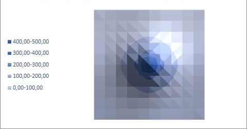

# Heat Diffusion Simulation

## Overview
This project simulates heat diffusion in a three-dimensional space where the temperature is 20°C everywhere except at a central heat source with a temperature of 500°C. The goal is to compare the performance of different materials in the three-dimensional domain using both explicit and implicit methods for solving the heat diffusion equation.

## Features
- **Explicit Method:** Implements a straightforward approach to heat diffusion.
- **Implicit Method:** Uses a more stable method for solving heat diffusion equations.

## Results

### Explicit Method
Result of the program with thermal conductivity coefficient a = 0.000019:

### Implicit Method
Result of the program with thermal conductivity coefficient a = 0.000216:

## Code Structure
- **Explicit Method:**
  - Initializes temperature distribution.
  - Updates temperature using explicit method.
  - Outputs result to file.

- **Implicit Method:**
  - Initializes temperature distribution.
  - Updates temperature using implicit method.
  - Outputs result to file.

## Dependencies
- **C++ Standard Library**: For file handling and mathematical operations.
